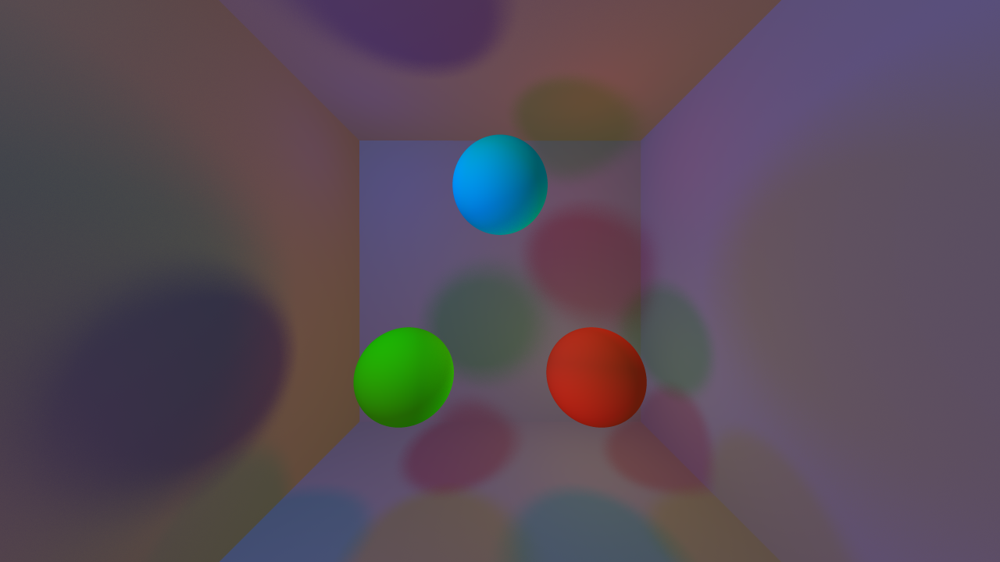

# <span style="color:lightblue">RAYTRACER

Project carried out by :

- [**Lucas HAUSZLER**](https://github.com/ripel2) 
- [**Axel IDOUX**](https://github.com/FoxaxeWasTaken) 
- [**Thibault GUYONY**](https://github.com/ThibaultGuyony) 
- [**Bastien GERARD**](https://github.com/BastienGeRard) 

## Project

### # Description

<div style="width: 650px;">
The main goal of the project was to develop a 3D raytracing engine from scratch, using the C++ programming language and the SFML library.
</div>

<br>

<div style="width: 650px;">
The raytracing project is a 3D image rendering project that uses ray tracing techniques to calculate the color and lighting of each pixel in the image. The main goal of this project is to generate realistic 3D images by simulating how light interacts with objects in a scene.
</div>

<br>

<div style="width: 650px;">
To generate an image, the program traces rays from the camera's eye and follows their path through the scene, using geometry and trigonometry techniques to determine how light is reflected, refracted, or absorbed by objects in the scene. By following this process, the program is able to calculate the color and lighting of each pixel in the image.
</div>

<hr>

### # Here is an example of a scene :



<hr>

### # How the program works

<div style="width: 650px;">
To create a 3D scene, lights, materials, and primitives are loaded as dynamic libraries (.so). Dynamic libraries allow for increased modularity of the project by separating functionality and allowing for dynamic memory management.
</div>

<hr>

### # Mandatory features

### # MUST

Your raytracer must support the following features:

- Primitives:
  - Sphere
  - Plane
- Transformations:
  - Translation
- Light:
  - Directional light
  - Ambient light
- Material:
  - Flat color
  - Scene configuration:
  - Add primitives to scene
  - Set up lighting
  - Set up camera
- Interface:
  - No GUI, output to a PPM file

### # SHOULD

Once the previous features are working properly, you should add the following ones:

- Primitives:
  - Cylinder
  - Cone
  - Transformation:
  - Rotation
- Light:
  - Drop shadows

### # COULD

Now that you’ve implemented the very basics of your raytracer, implement freely the following features:

- Primitives:
  - Limited cylinder
  - Limited cone
  - Torus
  - Tanglecube
  - Triangles
  - .OBJ file
  - Fractals
  - Möbius strip
- Transformations:
  - Scale
  - Shear
  - Transformation matrix
  - Scene graph
- Light:
  - Multiple directional lights
  - Multiple point lights
  - Colored light
  - Phong reflection model
  - Ambient occlusion
- Material:
  - Transparency
  - Refraction
  - Reflection
  - Texturing from file
  - Texturing from procedural generation of chessboard
  - Texturing from procedural generation of Perlin noise
  - Normal mapping
- Scene configuration:
  - Import a scene in a scene
  - Set up antialiasing through supersampling
  - Set up antialiasing through adaptative supersampling
- Optimizations:
  - Space partitionning
  - Multithreading
  - Clustering
- Interface:
  - Display the image during and after generation
  - Exit during or after generation
  - Scene preview using a basic and fast renderer
  - Automatic reload of the scene at file change

<hr>

## How to use it

```
∼/Raytracer> mkdir ./build/ && cd ./build/
∼/Raytracer> cmake .. -G “Unix Makefiles” -DCMAKE_BUILD_TYPE=Release
[...]
∼/Raytracer> cmake --build .
[...]
∼/Raytracer> cd ..
∼/Raytracer> ./raytracer tests/scenes/test1.cfg

```

### # Keys for the SFMLRenderer

<div style="width: 650px">
- Escape = Exit
<br>- P or MouseWheelUp = ZoomIn
<br>- L or MouseWheelDown = ZoomOut
<br>- KeyUp = Move view up
<br>- KeyDown = Move view down
<br>- KeyLeft = Move view to the left
<br>- KeyRight = Move view to the right
<br>- R = Reset view
<br>- S = Screenshot
</div>

### # Complete the Raytracer

<div style="width: 650px;">
You can create your own rendering scenes or implement your own primitives, lights and materials. To do this you can refer to the pdf files in the <span style="color:green">./docs</span> folder
</div>

### # Conclusion

<div style="width: 650px;">
In the end, the team was able to create a raytracing engine capable of generating realistic 3D images. The project allowed team members to develop their skills in C++ programming, teamwork, and project management within a limited timeframe.
</div>

<hr>
